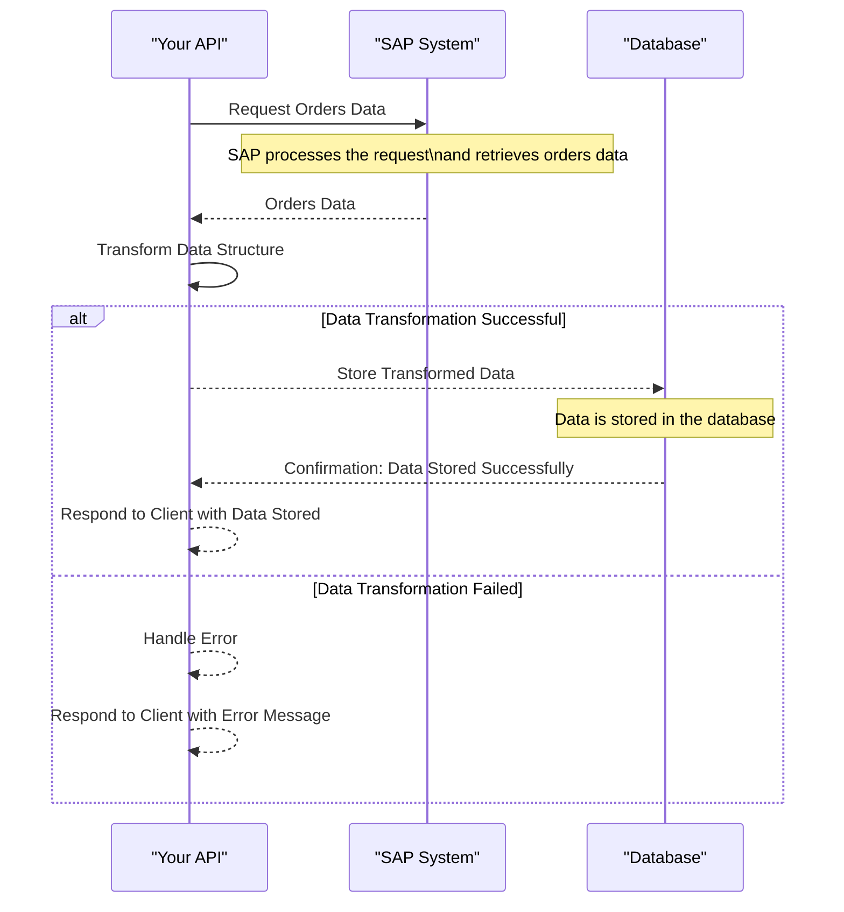

# My Project

## More Context

```mermaid
sequenceDiagram
    participant API as "Your API"
    participant SAP as "SAP System"
    participant Database as "Database"
    
    API->>SAP: Request Orders Data
    Note over SAP: SAP processes the request\nand retrieves orders data
    
    SAP-->>API: Orders Data
    API->>API: Transform Data Structure
    
    alt Data Transformation Successful
        API-->>Database: Store Transformed Data
        Note over Database: Data is stored in the database
        Database-->>API: Confirmation: Data Stored Successfully
        API-->>API: Respond to Client with Data Stored
    else Data Transformation Failed
        API-->>API: Handle Error
        API-->>API: Respond to Client with Error Message
    end
```

## More Context

asdfasd
f
das
fsdafsda

fasd
